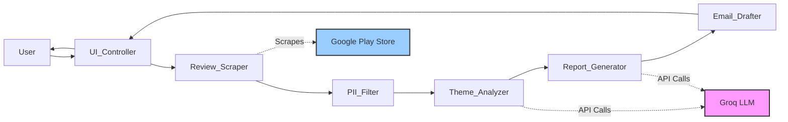
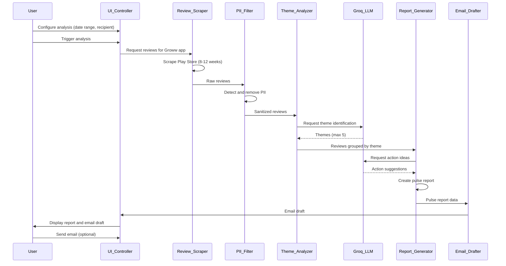

# Design Document: Play Store Review Analyzer

## Overview

The Play Store Review Analyzer is a web-based system that scrapes Google Play Store reviews for the Groww app and generates weekly pulse reports. The system provides a Flask-based web interface for triggering analysis, configuring parameters, and viewing reports. Reviews are scraped using the google-play-scraper library, filtered for PII, analyzed for themes using Groq LLM, and compiled into a concise one-page report with an email draft.

### Key Design Principles

1. **Privacy First**: All PII is removed before any analysis or LLM processing
2. **Pipeline Architecture**: Sequential processing stages with clear boundaries
3. **LLM-Powered Analysis**: Groq LLM handles theme identification and action idea generation
4. **Web-Based Interface**: Flask UI for easy configuration and report viewing
5. **Direct Scraping**: Uses google-play-scraper to fetch reviews directly from Play Store
6. **Actionable Output**: Focus on concise, scannable reports with specific action items

### System Boundaries

**In Scope:**
- Web-based user interface for configuration and report viewing
- Scraping reviews directly from Google Play Store (Groww app)
- PII detection and removal
- Theme identification using Groq LLM
- Report generation (one-page, 250 words max)
- Email draft creation and display

**Out of Scope:**
- Automated email sending (drafts only)
- Historical trend analysis beyond 8-12 weeks
- Multi-language support (assumes English reviews)
- Multi-app support (Groww app only)

## Architecture

### High-Level Architecture

The system follows a web-based pipeline architecture with six main components:



### Data Flow



### Component Architecture

Each component is designed as an independent module with clear inputs and outputs:

1. **UI_Controller**: Web interface → User configuration and report display
2. **Review_Scraper**: Play Store scraping → Structured review objects
3. **PII_Filter**: Review objects → Sanitized review objects
4. **Theme_Analyzer**: Sanitized reviews → Themed review groups
5. **Report_Generator**: Themed groups → Pulse report structure
6. **Email_Drafter**: Pulse report → Formatted email draft

## Components and Interfaces

### UI_Controller

**Purpose**: Provide a web-based interface for users to configure analysis parameters, trigger the review analysis pipeline, view generated reports, and manage email drafts.

**Technology Stack:**
- Framework: Flask (lightweight, easy to deploy)
- Template Engine: Jinja2 (built-in with Flask)
- Frontend: HTML/CSS with minimal JavaScript
- Forms: Flask-WTF for form handling and validation

**Inputs:**
- User configuration via web forms (date range, recipient email)
- User actions (trigger analysis, send email)

**Outputs:**
- HTML pages displaying configuration forms, reports, and status
- JSON responses for AJAX requests (optional for progress updates)

**Interface:**
```python
from flask import Flask, render_template, request, jsonify
from flask_wtf import FlaskForm
from wtforms import StringField, IntegerField, SubmitField
from wtforms.validators import Email, NumberRange

class AnalysisConfigForm(FlaskForm):
    """Form for configuring analysis parameters."""
    weeks_back = IntegerField(
        'Weeks Back', 
        validators=[NumberRange(min=8, max=12)],
        default=10
    )
    recipient_email = StringField(
        'Recipient Email',
        validators=[Email()]
    )
    submit = SubmitField('Run Analysis')

class UIController:
    def __init__(self, app: Flask):
        """Initialize Flask app with routes."""
        self.app = app
        self.setup_routes()
    
    def setup_routes(self):
        """Configure Flask routes."""
        
        @self.app.route('/')
        def index():
            """Display main configuration page."""
            form = AnalysisConfigForm()
            return render_template('index.html', form=form)
        
        @self.app.route('/analyze', methods=['POST'])
        def analyze():
            """Trigger analysis pipeline."""
            form = AnalysisConfigForm()
            if form.validate_on_submit():
                # Trigger pipeline
                result = self.run_pipeline(
                    weeks_back=form.weeks_back.data,
                    recipient=form.recipient_email.data
                )
                return render_template('report.html', report=result)
            return render_template('index.html', form=form, errors=form.errors)
        
        @self.app.route('/status')
        def status():
            """Get current analysis status (for progress updates)."""
            return jsonify(self.get_pipeline_status())
    
    def run_pipeline(self, weeks_back: int, recipient: str) -> PulseReport:
        """
        Execute the full analysis pipeline.
        
        Args:
            weeks_back: Number of weeks to analyze (8-12)
            recipient: Email address for report delivery
        
        Returns:
            PulseReport object with analysis results
        
        Raises:
            ScrapingError: If review scraping fails
            GroqAPIError: If LLM analysis fails
        """
        pass
    
    def get_pipeline_status(self) -> dict:
        """
        Get current pipeline execution status.
        
        Returns:
            Dictionary with status, progress, and current step
        """
        pass
```

**Routes:**
- `GET /` - Main page with configuration form
- `POST /analyze` - Trigger analysis with form data
- `GET /report/<report_id>` - View specific report
- `GET /status` - Get pipeline status (for progress updates)
- `POST /send-email` - Send email draft to recipient

**Page Templates:**

*index.html* - Configuration page:
```html
<form method="POST" action="/analyze">
  <label>Weeks Back (8-12):</label>
  <input type="number" name="weeks_back" min="8" max="12" value="10">
  
  <label>Recipient Email:</label>
  <input type="email" name="recipient_email" required>
  
  <button type="submit">Run Analysis</button>
</form>
```

*report.html* - Report display page:
```html
<h1>Weekly Pulse Report</h1>
<div class="report-content">
  {{ report.content | safe }}
</div>
<form method="POST" action="/send-email">
  <input type="hidden" name="report_id" value="{{ report.id }}">
  <button type="submit">Send Email</button>
</form>
```

**Error Handling:**
- Form validation errors → Display inline error messages
- Scraping failures → Display error page with retry button
- API errors → Display error message with details
- Invalid configuration → Highlight form fields with errors

### Review_Scraper

**Purpose**: Scrape Google Play Store reviews for the Groww app using the google-play-scraper library.

**Technology:**
- Library: `google-play-scraper` (Python package)
- Target App: Groww (com.nextbillion.groww)

**Inputs:**
- App ID: com.nextbillion.groww (hardcoded)
- Number of weeks back (8-12)
- Optional: Language (default: 'en')
- Optional: Country (default: 'us')

**Outputs:**
- List of Review objects
- Scraping summary (total reviews, date range, warnings)

**Interface:**
```python
from google_play_scraper import reviews, Sort
from datetime import datetime, timedelta

class ReviewScraper:
    APP_ID = "com.nextbillion.groww"
    
    def scrape_reviews(
        self, 
        weeks_back: int = 10,
        language: str = 'en',
        country: str = 'us'
    ) -> tuple[list[Review], ScrapingSummary]:
        """
        Scrape reviews from Google Play Store for Groww app.
        
        Args:
            weeks_back: Number of weeks to fetch (8-12)
            language: Review language code
            country: Country code for reviews
        
        Returns:
            - List of Review objects
            - ScrapingSummary with counts and metadata
        
        Raises:
            - ScrapingError: If Play Store is unavailable
            - ValidationError: If weeks_back is out of range
        """
        pass
    
    def _fetch_reviews_batch(
        self, 
        count: int = 200,
        continuation_token: str = None
    ) -> tuple[list[dict], str]:
        """
        Fetch a batch of reviews from Play Store.
        
        Returns:
            - List of raw review dictionaries
            - Continuation token for next batch
        """
        pass
    
    def _parse_review(self, raw_review: dict) -> Review:
        """
        Parse raw review data into Review object.
        
        Args:
            raw_review: Dictionary from google-play-scraper
        
        Returns:
            Review object with validated fields
        """
        pass
```

**Processing Logic:**
1. Validate weeks_back parameter (8-12 range)
2. Calculate cutoff date (current date - weeks_back)
3. Call google-play-scraper with app ID and parameters
4. Fetch reviews in batches (200 at a time)
5. Filter reviews by date (only include reviews >= cutoff date)
6. Parse each review into Review object
7. Validate required fields (rating, title, text, date)
8. Skip reviews with missing fields (log warning)
9. Continue until all reviews in date range are fetched
10. Return list of valid reviews and summary

**google-play-scraper Integration:**
```python
from google_play_scraper import reviews, Sort

# Fetch reviews sorted by newest first
result, continuation_token = reviews(
    'com.nextbillion.groww',
    lang='en',
    country='us',
    sort=Sort.NEWEST,
    count=200
)

# Each review has structure:
# {
#   'reviewId': 'unique_id',
#   'userName': 'User Name',
#   'userImage': 'url',
#   'content': 'Review text',
#   'score': 4,  # 1-5 rating
#   'thumbsUpCount': 10,
#   'reviewCreatedVersion': '1.2.3',
#   'at': datetime,  # Review date
#   'replyContent': 'Developer reply',
#   'repliedAt': datetime
# }
```

**Error Handling:**
- Play Store unavailable → Raise ScrapingError with retry guidance
- Network timeout → Retry with exponential backoff (3 attempts)
- Invalid app ID → Raise ValidationError
- Missing required fields → Log warning, skip review
- Rate limiting → Implement delays between batches (1-2 seconds)
- Empty results → Return empty list with warning

**Scraping Strategy:**
- Fetch in batches of 200 reviews
- Sort by newest first (Sort.NEWEST)
- Stop when reviews older than cutoff date are reached
- Implement 1-second delay between batches to avoid rate limiting
- Cache results to avoid re-scraping during development/testing

### Review_Importer

**Purpose**: Parse Play Store review export files and extract structured review data.

**Note**: This component is deprecated in favor of Review_Scraper but kept for backward compatibility with file-based imports.

**Inputs:**
- File path to review export (CSV or JSON format)
- Date range configuration (default: 8-12 weeks)

**Outputs:**
- List of Review objects
- Import summary (total reviews, skipped reviews, warnings)

**Interface:**
```python
class ReviewImporter:
    def import_reviews(
        self, 
        file_path: str, 
        min_weeks: int = 8, 
        max_weeks: int = 12
    ) -> tuple[list[Review], ImportSummary]:
        """
        Import reviews from export file within specified date range.
        
        Returns:
            - List of valid Review objects
            - ImportSummary with counts and warnings
        
        Raises:
            - FileNotFoundError: If file doesn't exist
            - InvalidFormatError: If file format is unsupported
        """
        pass
```

**Processing Logic:**
1. Validate file exists and is readable
2. Detect file format (CSV or JSON)
3. Parse each review entry
4. Validate required fields (rating, title, text, date)
5. Filter by date range (8-12 weeks from current date)
6. Validate rating is 1-5 stars
7. Log warnings for skipped reviews
8. Return valid reviews and summary

**Error Handling:**
- Missing required fields: Log warning, skip review
- Invalid rating: Log warning, skip review
- Malformed file: Raise InvalidFormatError
- Empty file: Return empty list with warning

### PII_Filter

**Purpose**: Remove personally identifiable information from review text before analysis.

**Inputs:**
- List of Review objects

**Outputs:**
- List of sanitized Review objects (with PII replaced)
- PII detection summary

**Interface:**
```python
class PIIFilter:
    def filter_reviews(
        self, 
        reviews: list[Review]
    ) -> tuple[list[Review], PIISummary]:
        """
        Remove PII from all review text fields.
        
        Returns:
            - List of Review objects with sanitized text
            - PIISummary with detection counts by type
        """
        pass
    
    def sanitize_text(self, text: str) -> tuple[str, list[PIIMatch]]:
        """
        Remove PII from a single text string.
        
        Returns:
            - Sanitized text with placeholders
            - List of detected PII matches
        """
        pass
```

**PII Detection Patterns:**
- **Usernames**: @username patterns, "user:" prefixes
- **Email addresses**: RFC 5322 compliant email regex
- **Phone numbers**: International formats (E.164), US formats
- **User IDs**: UUID patterns, numeric IDs in context

**Replacement Strategy:**
- Username → `[USERNAME]`
- Email → `[EMAIL]`
- Phone → `[PHONE]`
- User ID → `[USER_ID]`

**Processing Logic:**
1. For each review, process title and text fields
2. Apply regex patterns for each PII type
3. Replace matches with appropriate placeholders
4. Track detection counts for summary
5. Return sanitized reviews

### Theme_Analyzer

**Purpose**: Use Groq LLM to identify common themes across reviews and group them.

**Inputs:**
- List of sanitized Review objects
- Groq API key
- Configuration (max themes, model version)

**Outputs:**
- List of Theme objects with associated reviews
- Analysis metadata (model version, timestamp)

**Interface:**
```python
class ThemeAnalyzer:
    def __init__(self, api_key: str, model: str = "mixtral-8x7b-32768"):
        """Initialize with Groq API credentials."""
        pass
    
    def analyze_themes(
        self, 
        reviews: list[Review], 
        max_themes: int = 5
    ) -> tuple[list[Theme], AnalysisMetadata]:
        """
        Identify themes across reviews using Groq LLM.
        
        Returns:
            - List of Theme objects (max 5) ranked by frequency
            - AnalysisMetadata with model info and timestamp
        
        Raises:
            - GroqAPIError: If API call fails
            - AuthenticationError: If API key is invalid
        """
        pass
```

**Groq LLM Integration:**

*Prompt Template for Theme Identification:*
```
You are analyzing Google Play Store reviews to identify common themes.

Reviews:
{review_list}

Task: Identify up to 5 distinct themes that appear across these reviews. For each theme:
1. Provide a concise label (2-4 words)
2. List the review indices that belong to this theme
3. Rank themes by frequency (most common first)

Output format (JSON):
{
  "themes": [
    {
      "label": "Theme Label",
      "review_indices": [0, 3, 7],
      "frequency": 3
    }
  ]
}

Requirements:
- Maximum 5 themes
- Each review must be assigned to at least one theme
- Themes should be distinct and non-overlapping where possible
- Focus on actionable product/UX issues
```

**Processing Logic:**
1. Prepare review data for LLM (format as numbered list)
2. Construct prompt with review text
3. Call Groq API with theme identification prompt
4. Parse JSON response
5. Validate response structure
6. Create Theme objects with associated reviews
7. Sort themes by frequency
8. Return top 5 themes (or fewer if less exist)

**Error Handling:**
- API unavailable: Raise GroqAPIError with retry guidance
- Invalid API key: Raise AuthenticationError
- Malformed response: Log error, attempt to parse partial data
- Rate limiting: Implement exponential backoff

### Report_Generator

**Purpose**: Create a concise one-page pulse report with themes, quotes, and action ideas.

**Inputs:**
- List of Theme objects with reviews
- Groq API key
- Configuration (word limit, quote count, action count)

**Outputs:**
- PulseReport object
- Generation metadata

**Interface:**
```python
class ReportGenerator:
    def __init__(self, api_key: str, model: str = "mixtral-8x7b-32768"):
        """Initialize with Groq API credentials."""
        pass
    
    def generate_report(
        self, 
        themes: list[Theme],
        max_words: int = 250,
        quote_count: int = 3,
        action_count: int = 3
    ) -> tuple[PulseReport, GenerationMetadata]:
        """
        Generate weekly pulse report from themes.
        
        Returns:
            - PulseReport with top 3 themes, quotes, and actions
            - GenerationMetadata with timestamp and word count
        
        Raises:
            - GroqAPIError: If API call fails
        """
        pass
```

**Report Structure:**
```
Weekly Pulse Report
Week of [Date Range]

TOP THEMES:
1. [Theme 1 Label] - [Brief description]
2. [Theme 2 Label] - [Brief description]
3. [Theme 3 Label] - [Brief description]

USER VOICES:
• "[Quote 1 from Theme 1]"
• "[Quote 2 from Theme 2]"
• "[Quote 3 from Theme 3]"

ACTION IDEAS:
1. [Actionable suggestion based on Theme 1]
2. [Actionable suggestion based on Theme 2]
3. [Actionable suggestion based on Theme 3]
```

**Groq LLM Integration for Action Ideas:**

*Prompt Template:*
```
You are a product strategist analyzing user feedback themes.

Themes identified:
1. {theme_1_label}: {theme_1_description}
2. {theme_2_label}: {theme_2_description}
3. {theme_3_label}: {theme_3_description}

Task: Generate 3 specific, actionable improvement ideas based on these themes.

Requirements:
- Each action should address one theme
- Be specific and implementable
- Focus on quick wins or high-impact changes
- Keep each action to 1-2 sentences
- Output as JSON array

Output format:
{
  "actions": [
    "Action idea 1",
    "Action idea 2",
    "Action idea 3"
  ]
}
```

**Processing Logic:**
1. Select top 3 themes by frequency
2. Select 3 representative quotes (one per theme)
3. Call Groq API for action idea generation
4. Parse action ideas from response
5. Assemble report structure
6. Validate word count (≤250 words)
7. Format for readability
8. Return PulseReport object

**Quote Selection Strategy:**
- Choose quotes that clearly illustrate the theme
- Prefer quotes with specific details
- Ensure quotes are from different themes
- Prioritize shorter, punchier quotes
- Verify no PII in selected quotes

### Email_Drafter

**Purpose**: Format the pulse report as an email draft ready for sending.

**Inputs:**
- PulseReport object
- Email configuration (recipient, date range)

**Outputs:**
- Email draft file (text or HTML)
- Draft metadata

**Interface:**
```python
class EmailDrafter:
    def draft_email(
        self, 
        report: PulseReport,
        recipient: str,
        date_range: tuple[date, date],
        output_format: str = "text"
    ) -> tuple[str, DraftMetadata]:
        """
        Create email draft from pulse report.
        
        Returns:
            - Path to email draft file
            - DraftMetadata with recipient and timestamp
        """
        pass
```

**Email Template:**
```
Subject: Play Store Pulse Report - Week of {start_date} to {end_date}

To: {recipient}

Hi team,

Here's this week's Play Store review pulse report covering {review_count} reviews from {start_date} to {end_date}.

{pulse_report_content}

---
Generated by Play Store Review Analyzer
{generation_timestamp}
```

**Processing Logic:**
1. Format subject line with date range
2. Insert recipient address
3. Format report content with proper spacing
4. Add metadata footer
5. Write to output file
6. Return file path and metadata

### UI Display and Interaction

**Purpose**: Present reports and email drafts to users through the web interface.

**Report Display:**
- Show report in formatted HTML with clear sections
- Highlight themes, quotes, and action ideas
- Display metadata (date range, review count, generation time)
- Provide "Send Email" button for delivery

**Status Display:**
- Show progress bar during pipeline execution
- Display current step (Scraping, Filtering, Analyzing, Generating)
- Update progress percentage in real-time (via AJAX or page refresh)
- Show estimated time remaining (optional)

**Error Display:**
- Show error messages in user-friendly format
- Provide retry button for recoverable errors
- Display technical details in collapsible section
- Suggest corrective actions (e.g., "Check internet connection")

**Email Sending:**
- Display email draft preview before sending
- Confirm recipient address
- Show success message after sending
- Log sent emails for tracking

## Data Models

### Review

Represents a single Play Store review.

```python
@dataclass
class Review:
    """A Google Play Store review."""
    
    rating: int  # 1-5 stars
    title: str  # Review title
    text: str  # Review body text
    date: datetime  # Review submission date
    review_id: str  # Unique identifier (generated)
    is_sanitized: bool = False  # PII removal flag
    
    def __post_init__(self):
        """Validate review data."""
        if not 1 <= self.rating <= 5:
            raise ValueError(f"Rating must be 1-5, got {self.rating}")
        if not self.title or not self.text:
            raise ValueError("Title and text are required")
```

### Theme

Represents a common theme identified across multiple reviews.

```python
@dataclass
class Theme:
    """A theme identified across reviews."""
    
    label: str  # Short descriptive label (2-4 words)
    description: str  # Brief explanation of theme
    reviews: list[Review]  # Reviews belonging to this theme
    frequency: int  # Number of reviews in theme
    rank: int  # Ranking by frequency (1 = most common)
    
    def __post_init__(self):
        """Validate theme data."""
        if self.frequency != len(self.reviews):
            raise ValueError("Frequency must match review count")
        if self.rank < 1:
            raise ValueError("Rank must be positive")
```

### PulseReport

Represents the weekly one-page report output.

```python
@dataclass
class PulseReport:
    """Weekly pulse report containing themes, quotes, and actions."""
    
    date_range: tuple[date, date]  # Report coverage period
    themes: list[Theme]  # Top 3 themes
    quotes: list[str]  # 3 representative user quotes
    action_ideas: list[str]  # 3 actionable suggestions
    word_count: int  # Total word count
    review_count: int  # Total reviews analyzed
    generation_timestamp: datetime  # When report was created
    
    def __post_init__(self):
        """Validate report constraints."""
        if len(self.themes) != 3:
            raise ValueError("Report must contain exactly 3 themes")
        if len(self.quotes) != 3:
            raise ValueError("Report must contain exactly 3 quotes")
        if len(self.action_ideas) != 3:
            raise ValueError("Report must contain exactly 3 action ideas")
        if self.word_count > 250:
            raise ValueError(f"Report exceeds 250 word limit: {self.word_count}")
```

### Supporting Data Models

```python
@dataclass
class ScrapingSummary:
    """Summary of review scraping operation."""
    total_reviews: int
    valid_reviews: int
    skipped_reviews: int
    warnings: list[str]
    date_range: tuple[date, date]
    app_id: str
    scrape_timestamp: datetime

@dataclass
class ImportSummary:
    """Summary of review import operation (file-based)."""
    total_reviews: int
    valid_reviews: int
    skipped_reviews: int
    warnings: list[str]
    date_range: tuple[date, date]

@dataclass
class PIISummary:
    """Summary of PII detection and removal."""
    reviews_processed: int
    pii_instances_found: int
    pii_by_type: dict[str, int]  # e.g., {"email": 5, "phone": 2}

@dataclass
class AnalysisMetadata:
    """Metadata from theme analysis."""
    model_version: str
    timestamp: datetime
    total_themes: int
    total_reviews: int

@dataclass
class GenerationMetadata:
    """Metadata from report generation."""
    timestamp: datetime
    word_count: int
    model_version: str

@dataclass
class DraftMetadata:
    """Metadata from email draft creation."""
    recipient: str
    timestamp: datetime
    output_path: str
```

### Configuration Models

```python
@dataclass
class GroqConfig:
    """Configuration for Groq LLM integration."""
    api_key: str
    model: str = "mixtral-8x7b-32768"
    timeout: int = 30  # seconds
    max_retries: int = 3
    
@dataclass
class ScraperConfig:
    """Configuration for review scraping."""
    app_id: str = "com.nextbillion.groww"
    language: str = "en"
    country: str = "us"
    batch_size: int = 200
    delay_between_batches: float = 1.0  # seconds
    
@dataclass
class SystemConfig:
    """Overall system configuration."""
    groq: GroqConfig
    scraper: ScraperConfig
    min_weeks: int = 8
    max_weeks: int = 12
    max_themes: int = 5
    report_word_limit: int = 250
    quote_count: int = 3
    action_count: int = 3
```

### UI Data Models

```python
@dataclass
class AnalysisRequest:
    """User request for analysis via UI."""
    weeks_back: int  # 8-12
    recipient_email: str
    request_timestamp: datetime
    request_id: str  # Unique identifier
    
    def __post_init__(self):
        """Validate request parameters."""
        if not 8 <= self.weeks_back <= 12:
            raise ValueError(f"weeks_back must be 8-12, got {self.weeks_back}")
        if not self.recipient_email or '@' not in self.recipient_email:
            raise ValueError("Invalid email address")

@dataclass
class PipelineStatus:
    """Current status of analysis pipeline."""
    request_id: str
    status: str  # 'pending', 'scraping', 'filtering', 'analyzing', 'generating', 'complete', 'error'
    current_step: str  # Human-readable current step
    progress_percent: int  # 0-100
    error_message: str = None
    started_at: datetime = None
    completed_at: datetime = None
    
    def __post_init__(self):
        """Validate status values."""
        valid_statuses = ['pending', 'scraping', 'filtering', 'analyzing', 'generating', 'complete', 'error']
        if self.status not in valid_statuses:
            raise ValueError(f"Invalid status: {self.status}")
        if not 0 <= self.progress_percent <= 100:
            raise ValueError(f"Progress must be 0-100, got {self.progress_percent}")

@dataclass
class ReportView:
    """Report data formatted for UI display."""
    report_id: str
    pulse_report: PulseReport
    email_draft: str
    recipient: str
    created_at: datetime
    is_sent: bool = False
    sent_at: datetime = None
```


## Correctness Properties

A property is a characteristic or behavior that should hold true across all valid executions of a system—essentially, a formal statement about what the system should do. Properties serve as the bridge between human-readable specifications and machine-verifiable correctness guarantees.

### Property Reflection

After analyzing all acceptance criteria, I identified several areas where properties can be consolidated:

**Consolidations Made:**
- Properties 1.3 and 1.4 (date range filtering) can be combined into a single property about date range boundaries
- Properties 4.1-4.4 (PII removal for different types) can be combined into a comprehensive PII removal property
- Properties 3.2 and 3.3 (exact counts for quotes and actions) are similar constraints and can be validated together
- Properties 1.2 and 1.6 both validate review field correctness and can be combined

**Properties Kept Separate:**
- Theme ranking (2.4) and theme count constraint (2.2) test different aspects
- Quote diversity (3.6) and quote count (3.2) serve different validation purposes
- PII removal (4.1-4.4) and PII placeholder replacement (4.7) test different behaviors
- UI validation (24, 25) and scraping retry logic (27, 28) address distinct concerns

**New Properties Added:**
- Properties 24-26 validate UI-specific behavior (form validation, status tracking)
- Properties 27-28 validate scraping-specific behavior (retry logic, rate limiting)
- Property 1 updated to reflect scraping instead of file import

### Property 1: Valid App ID and Scraping Success

For any scraping request with the valid Groww app ID (com.nextbillion.groww), the Review_Scraper should successfully connect to the Play Store and return reviews (or an empty list if no reviews exist in the date range).

**Validates: Requirements 1.1**

### Property 2: Complete Field Extraction

For any valid review entry (from scraping or file import), the system should successfully extract all required fields (rating, title, text, date) and the rating should be within the valid range of 1-5 stars.

**Validates: Requirements 1.2, 1.6**

### Property 3: Date Range Filtering

For any set of reviews with various dates, the system should include all reviews from the last 8-12 weeks and exclude all reviews older than 12 weeks from the current date.

**Validates: Requirements 1.3, 1.4**

### Property 4: Invalid Review Handling

For any review missing required fields (rating, title, text, or date), the system should skip that review, log a warning, and continue processing remaining reviews.

**Validates: Requirements 1.5**

### Property 5: Theme Count Constraint

For any set of reviews analyzed, the Theme_Analyzer should return at most 5 themes, and if fewer than 5 distinct themes exist, it should return only the actual number identified.

**Validates: Requirements 2.2, 2.5**

### Property 6: Theme Labeling

For any theme identified by the Theme_Analyzer, the theme should have a non-empty descriptive label.

**Validates: Requirements 2.3**

### Property 7: Theme Frequency Ranking

For any list of themes returned by the Theme_Analyzer, the themes should be ordered by frequency in descending order (most common first).

**Validates: Requirements 2.4**

### Property 8: Complete Review Assignment

For any set of reviews analyzed, every review should be associated with at least one theme in the output.

**Validates: Requirements 2.6**

### Property 9: Top Themes Selection

For any set of themes provided to the Report_Generator, the generated Pulse_Report should contain exactly the top 3 themes by frequency.

**Validates: Requirements 3.1**

### Property 10: Report Structure Constraints

For any generated Pulse_Report, it should contain exactly 3 user quotes and exactly 3 action ideas.

**Validates: Requirements 3.2, 3.3**

### Property 11: Word Count Limit

For any generated Pulse_Report, the total word count should not exceed 250 words.

**Validates: Requirements 3.4**

### Property 12: Quote Theme Diversity

For any Pulse_Report with 3 quotes, each quote should represent a different theme from the top 3 themes.

**Validates: Requirements 3.6**

### Property 13: Comprehensive PII Removal

For any text containing PII patterns (usernames, email addresses, user IDs, or phone numbers), the PII_Filter should detect and remove all instances of these patterns.

**Validates: Requirements 4.1, 4.2, 4.3, 4.4**

### Property 14: PII-Free Report Output

For any generated Pulse_Report, the report content should not contain any PII patterns (usernames, emails, user IDs, phone numbers).

**Validates: Requirements 4.6**

### Property 15: PII Placeholder Replacement

For any text where PII is detected and removed, the PII_Filter should replace the PII with an appropriate generic placeholder (not just delete it).

**Validates: Requirements 4.7**

### Property 16: Email Subject Date Range

For any email draft created, the subject line should contain the date range covered by the report.

**Validates: Requirements 5.2**

### Property 17: Email Structure Completeness

For any email draft created, the email body should contain identifiable sections for themes, quotes, and action ideas.

**Validates: Requirements 5.3**

### Property 18: Email Recipient Configuration

For any recipient address provided to the Email_Drafter, that exact address should appear in the generated email draft.

**Validates: Requirements 5.4**

### Property 19: Email File Output

For any email draft created, the Email_Drafter should write the draft to a file and the file should exist after the operation completes.

**Validates: Requirements 5.5**

### Property 20: API Error Handling

For any Groq LLM API error encountered, the system should return an error message with retry guidance and halt processing.

**Validates: Requirements 6.2, 6.5**

### Property 21: Model Version Logging

For any processing run that uses Groq LLM, the system logs should include the model version used for reproducibility.

**Validates: Requirements 6.6**

### Property 22: UI-Based Configuration

For any analysis request, the system should accept configuration only through the UI_Controller web interface (not direct API calls or command-line arguments).

**Validates: Requirements 7.1**

### Property 23: Credential Rejection

For any input that contains credential-like information (API keys, passwords, tokens), the system should reject the input and display a warning.

**Validates: Requirements 7.4**

### Property 24: UI Form Validation for Date Range

For any weeks_back value submitted via the UI form, the UI_Controller should accept values between 8 and 12 (inclusive) and reject all other values with a validation error.

**Validates: Requirements 7.2, 7.8**

### Property 25: UI Email Format Validation

For any recipient email address submitted via the UI form, the UI_Controller should accept valid email formats (containing @ and domain) and reject invalid formats with a validation error.

**Validates: Requirements 7.3**

### Property 26: Pipeline Status Tracking

For any analysis request triggered via the UI, the UI_Controller should maintain a PipelineStatus object that accurately reflects the current step and progress percentage throughout execution.

**Validates: Requirements 7.6**

### Property 27: Scraping Retry Logic

For any network error or timeout during review scraping, the Review_Scraper should retry the operation with exponential backoff up to 3 times before raising a ScrapingError.

**Validates: Requirements 1.7**

### Property 28: Scraping Rate Limiting

For any batch of reviews scraped, the Review_Scraper should implement a delay between batches to avoid rate limiting by the Play Store.

**Validates: Requirements 1.1** (implicit requirement for reliable scraping)

## Error Handling

### Error Categories

The system handles five categories of errors:

1. **Input Errors**: Invalid configuration, malformed data, missing fields
2. **Scraping Errors**: Play Store unavailable, network failures, rate limiting
3. **Processing Errors**: PII detection failures, theme analysis issues
4. **API Errors**: Groq LLM unavailability, authentication failures, rate limiting
5. **Output Errors**: File write failures, formatting issues

### Error Handling Strategy

**Input Errors:**
- Invalid weeks_back (not 8-12) → Display form validation error
- Invalid email format → Display form validation error
- Invalid file format (legacy) → Raise `InvalidFormatError` with supported formats
- Missing required fields → Log warning, skip review, continue processing
- Invalid rating → Log warning, skip review, continue processing

**Scraping Errors:**
- Play Store unavailable → Raise `ScrapingError` with retry guidance, display error page
- Network timeout → Retry with exponential backoff (1s, 2s, 4s), max 3 attempts
- Rate limiting → Implement delays between batches, reduce batch size if needed
- Invalid app ID → Raise `ValidationError` (should not occur with hardcoded ID)
- Empty results → Return empty list with warning, display message to user
- Connection errors → Retry with backoff, display error if all retries fail

**Processing Errors:**
- PII detection regex failure → Log error, continue with unfiltered text (fail-safe)
- Theme analysis parsing error → Log error, attempt partial data recovery
- Insufficient reviews for themes → Return warning, generate report with available data

**API Errors:**
- Authentication failure → Raise `AuthenticationError` with API key validation guidance
- API unavailable (5xx errors) → Raise `GroqAPIError` with retry guidance
- Rate limiting (429) → Implement exponential backoff (1s, 2s, 4s), max 3 retries
- Timeout → Retry with increased timeout, max 3 attempts
- Malformed response → Log error, raise `APIResponseError` with response details

**Output Errors:**
- File write failure → Raise `IOError` with file path and permissions info
- Word count exceeded → Log warning, truncate report to 250 words
- Missing sections → Raise `ReportFormatError` with missing section details
- Email send failure → Display error message, allow retry

### Error Recovery

**Graceful Degradation:**
- If < 3 themes found → Generate report with available themes
- If quote selection fails → Use first available quotes from themes
- If action idea generation fails → Provide generic action suggestions

**Retry Logic:**
```python
def retry_with_backoff(func, max_retries=3):
    """Retry function with exponential backoff."""
    for attempt in range(max_retries):
        try:
            return func()
        except (APIError, TimeoutError) as e:
            if attempt == max_retries - 1:
                raise
            wait_time = 2 ** attempt
            log.warning(f"Attempt {attempt + 1} failed, retrying in {wait_time}s")
            time.sleep(wait_time)
```

### Logging Strategy

**Log Levels:**
- `ERROR`: API failures, file I/O errors, authentication issues
- `WARNING`: Skipped reviews, missing fields, PII detection issues
- `INFO`: Processing milestones, API calls, report generation
- `DEBUG`: Detailed parsing info, regex matches, API request/response

**Required Log Information:**
- Timestamp (ISO 8601 format)
- Component name (e.g., "Review_Scraper", "Theme_Analyzer", "UI_Controller")
- Operation (e.g., "scrape_reviews", "analyze_themes", "run_pipeline")
- Model version (for LLM operations)
- Error details (for failures)
- Review counts (for processing operations)

## Testing Strategy

### Dual Testing Approach

The system requires both unit testing and property-based testing for comprehensive coverage:

**Unit Tests** focus on:
- Specific examples demonstrating correct behavior
- Edge cases (empty files, single review, boundary dates)
- Error conditions (invalid formats, API failures)
- Integration points between components

**Property-Based Tests** focus on:
- Universal properties that hold for all inputs
- Comprehensive input coverage through randomization
- Invariants that must be maintained
- Round-trip properties (where applicable)

Together, unit tests catch concrete bugs while property tests verify general correctness across the input space.

### Property-Based Testing Configuration

**Framework Selection:**
- Python: Use `hypothesis` library
- Minimum 100 iterations per property test (due to randomization)
- Each test must reference its design document property

**Test Tag Format:**
```python
@given(reviews=st.lists(review_strategy(), min_size=1))
@settings(max_examples=100)
def test_property_3_date_range_filtering(reviews):
    """
    Feature: play-store-review-analyzer
    Property 3: For any set of reviews with various dates, the system 
    should include all reviews from the last 8-12 weeks and exclude all reviews 
    older than 12 weeks from the current date.
    """
    # Test implementation
```

### Test Coverage by Component

**UI_Controller:**

Unit Tests:
- Render index page with form
- Validate form with valid inputs (weeks_back=10, valid email)
- Reject form with invalid weeks_back (7, 13)
- Reject form with invalid email format
- Display report page after successful analysis
- Display error page when scraping fails
- Handle POST to /analyze endpoint
- Handle GET to /status endpoint
- Verify CSRF protection on forms

Property Tests:
- Property 24: Form validation for weeks_back range
- Property 25: Email format validation
- Property 26: Pipeline status tracking

**Review_Scraper:**

Unit Tests:
- Scrape 50 reviews from Groww app
- Filter reviews by date (10 weeks back)
- Handle Play Store unavailable error
- Handle network timeout with retry
- Parse review with all fields present
- Skip review with missing content field
- Handle rate limiting with delays
- Stop scraping when reaching date cutoff

Property Tests:
- Property 1: Valid app ID acceptance (modified for scraping)
- Property 2: Complete field extraction
- Property 3: Date range filtering
- Property 4: Invalid review handling
- Property 27: Scraping retry logic
- Property 28: Rate limiting handling

**Review_Importer (Legacy):**

Unit Tests:
- Parse valid CSV file with 10 reviews
- Parse valid JSON file with 10 reviews
- Handle empty file gracefully
- Skip review with missing title
- Skip review with invalid rating (0, 6, -1)
- Handle file not found error
- Parse reviews exactly at 8-week boundary
- Parse reviews exactly at 12-week boundary

Property Tests:
- Property 1: Valid file format acceptance
- Property 2: Complete field extraction
- Property 3: Date range filtering
- Property 4: Invalid review handling
- Property 22: File-only input constraint

**PII_Filter:**

Unit Tests:
- Remove email from review text
- Remove phone number (US format)
- Remove phone number (international format)
- Remove username with @ prefix
- Remove UUID pattern
- Handle text with no PII
- Handle text with multiple PII types

Property Tests:
- Property 13: Comprehensive PII removal
- Property 14: PII-free report output
- Property 15: PII placeholder replacement

**Theme_Analyzer:**

Unit Tests:
- Analyze 10 reviews with clear themes
- Handle single review
- Handle reviews with no clear themes
- Handle API authentication failure
- Handle API timeout
- Handle malformed API response
- Verify API request includes model version

Property Tests:
- Property 5: Theme count constraint
- Property 6: Theme labeling
- Property 7: Theme frequency ranking
- Property 8: Complete review assignment
- Property 20: API error handling
- Property 21: Model version logging

**Report_Generator:**

Unit Tests:
- Generate report from 3 themes
- Generate report from 2 themes (edge case)
- Select quotes from different themes
- Handle action idea generation failure
- Verify word count calculation
- Verify report structure sections

Property Tests:
- Property 9: Top themes selection
- Property 10: Report structure constraints
- Property 11: Word count limit
- Property 12: Quote theme diversity
- Property 20: API error handling

**Email_Drafter:**

Unit Tests:
- Draft email with standard report
- Verify subject line format
- Verify recipient in output
- Handle file write failure
- Verify section headers present

Property Tests:
- Property 16: Email subject date range
- Property 17: Email structure completeness
- Property 18: Email recipient configuration
- Property 19: Email file output

### Integration Tests

**End-to-End Pipeline:**
1. Configure analysis via UI → Scrape reviews → Filter PII → Analyze themes → Generate report → Draft email → Display in UI
2. Verify no PII in final email draft
3. Verify report meets all constraints (3 themes, 3 quotes, 3 actions, ≤250 words)
4. Verify email draft is displayed correctly
5. Verify status updates during pipeline execution

**UI Integration:**
1. Submit form with valid configuration → Verify pipeline starts
2. Submit form with invalid configuration → Verify error messages
3. View report page → Verify all sections present
4. Trigger email send → Verify email draft is used

**Scraping Integration:**
1. Scrape Groww app reviews → Verify reviews are fetched
2. Mock Play Store unavailable → Verify error handling
3. Mock rate limiting → Verify retry logic
4. Scrape with different date ranges → Verify filtering

**API Integration:**
1. Mock Groq API responses for theme analysis
2. Mock Groq API responses for action idea generation
3. Test retry logic with simulated API failures
4. Test rate limiting handling

### Test Data Generation

**Hypothesis Strategies:**

```python
from hypothesis import strategies as st
from datetime import datetime, timedelta

@st.composite
def review_strategy(draw):
    """Generate random valid reviews."""
    return Review(
        rating=draw(st.integers(min_value=1, max_value=5)),
        title=draw(st.text(min_size=1, max_size=100)),
        text=draw(st.text(min_size=10, max_size=500)),
        date=draw(st.datetimes(
            min_value=datetime.now() - timedelta(weeks=20),
            max_value=datetime.now()
        )),
        review_id=draw(st.uuids()).hex
    )

@st.composite
def review_with_pii_strategy(draw):
    """Generate reviews containing PII."""
    base_text = draw(st.text(min_size=10, max_size=200))
    pii_type = draw(st.sampled_from(['email', 'phone', 'username', 'user_id']))
    
    if pii_type == 'email':
        pii = f"{draw(st.text(min_size=3, max_size=10))}@example.com"
    elif pii_type == 'phone':
        pii = f"+1{draw(st.integers(min_value=1000000000, max_value=9999999999))}"
    elif pii_type == 'username':
        pii = f"@{draw(st.text(min_size=3, max_size=15))}"
    else:  # user_id
        pii = draw(st.uuids()).hex
    
    return base_text + " " + pii

@st.composite
def analysis_request_strategy(draw):
    """Generate random valid analysis requests."""
    return AnalysisRequest(
        weeks_back=draw(st.integers(min_value=8, max_value=12)),
        recipient_email=f"{draw(st.text(min_size=3, max_size=10))}@example.com",
        request_timestamp=datetime.now(),
        request_id=draw(st.uuids()).hex
    )
```

**Mock Data for Scraping:**

```python
def mock_play_store_response():
    """Mock response from google-play-scraper."""
    return [
        {
            'reviewId': 'abc123',
            'userName': 'Test User',
            'content': 'Great app for investing!',
            'score': 5,
            'at': datetime.now() - timedelta(days=10),
            'thumbsUpCount': 5
        },
        # ... more reviews
    ]
```

### Continuous Testing

**Pre-commit Checks:**
- Run all unit tests
- Run property tests with 100 iterations
- Verify no PII in test outputs
- Check code coverage (target: 80%+)

**CI/CD Pipeline:**
- Run full test suite on every commit
- Run property tests with 1000 iterations (extended)
- Integration tests with mocked APIs
- Generate coverage report

### Performance Testing

**Benchmarks:**
- Scrape 1000 reviews: < 30 seconds (depends on network)
- Import 1000 reviews (file): < 5 seconds
- PII filtering 1000 reviews: < 2 seconds
- Theme analysis (API call): < 10 seconds
- Report generation: < 5 seconds
- UI page load: < 1 second
- End-to-end pipeline: < 60 seconds

**Load Testing:**
- Test with 10,000 reviews
- Test with reviews containing extensive PII
- Test with very long review text (5000+ characters)
- Test concurrent UI requests (5 simultaneous users)
- Test scraping with rate limiting active

## Implementation Phases

### Phase 1: Core Data Pipeline (Week 1)

**Objectives:**
- Implement Review_Scraper with google-play-scraper integration
- Implement PII_Filter with regex-based detection
- Set up basic data models
- Establish error handling framework

**Deliverables:**
- `review_scraper.py` with Play Store scraping
- `pii_filter.py` with PII detection patterns
- `models.py` with all data classes
- Unit tests for scraper and filter
- Property tests for Properties 1-4, 13-15, 27-28

**Dependencies:**
- Install `google-play-scraper` library
- Configure scraping parameters (app ID, delays)

**Success Criteria:**
- Can scrape reviews from Groww app
- PII is correctly detected and removed
- All Phase 1 property tests pass

### Phase 2: Web UI Foundation (Week 2)

**Objectives:**
- Implement UI_Controller with Flask
- Create configuration forms
- Add basic routing and templates
- Implement form validation

**Deliverables:**
- `ui_controller.py` with Flask app
- `templates/index.html` with configuration form
- `templates/report.html` for report display
- `templates/error.html` for error display
- Form validation with Flask-WTF
- Unit tests for UI routes
- Property tests for Properties 24-26

**Dependencies:**
- Install Flask, Flask-WTF
- Set up template structure
- Configure Flask app settings

**Success Criteria:**
- UI loads and displays configuration form
- Form validation works correctly
- Can trigger analysis from UI
- All Phase 2 property tests pass

### Phase 3: Groq LLM Integration (Week 3)

**Objectives:**
- Implement Theme_Analyzer with Groq API integration
- Implement retry logic and error handling
- Create prompt templates for theme identification
- Add API authentication and configuration

**Deliverables:**
- `theme_analyzer.py` with Groq integration
- `groq_client.py` with API wrapper
- Configuration management for API keys
- Unit tests with mocked API responses
- Property tests for Properties 5-8, 20-21

**Success Criteria:**
- Successfully calls Groq API for theme analysis
- Handles API errors gracefully with retries
- Returns properly structured themes
- All Phase 3 property tests pass

### Phase 4: Report Generation (Week 4)

**Objectives:**
- Implement Report_Generator with action idea generation
- Implement quote selection logic
- Add word count validation
- Create report formatting

**Deliverables:**
- `report_generator.py` with report assembly
- Quote selection algorithm
- Word count enforcement
- Unit tests for report generation
- Property tests for Properties 9-12

**Success Criteria:**
- Generates reports meeting all constraints
- Selects diverse quotes from themes
- Action ideas are relevant and actionable
- All Phase 4 property tests pass

### Phase 5: Email Output and Integration (Week 5)

**Objectives:**
- Implement Email_Drafter with formatting
- Add email template system
- Complete end-to-end UI integration
- Add status tracking for pipeline

**Deliverables:**
- `email_drafter.py` with email formatting
- Email templates
- Pipeline status tracking
- UI updates for report display
- Integration tests for full pipeline
- Property tests for Properties 16-19, 22-23

**Success Criteria:**
- Email drafts are properly formatted
- All sections are present and correct
- UI displays reports correctly
- End-to-end pipeline works from UI
- All property tests pass (100 iterations minimum)

### Phase 6: Testing and Documentation (Week 6)

**Objectives:**
- Complete property-based test suite
- Run extended property tests (1000 iterations)
- Write user documentation
- Create deployment guide
- Performance optimization

**Deliverables:**
- Complete test suite with 80%+ coverage
- User guide and API documentation
- Deployment guide (Flask app setup)
- Performance benchmarks
- Docker configuration (optional)

**Success Criteria:**
- All 28 properties validated with 1000 iterations
- Documentation is complete and clear
- Performance meets benchmarks
- System is ready for production use
- Flask app can be deployed

